# Classification

## [分类算法-感知机](http://www.citisy.site/posts/49759.html)

[perceptron.py](Classification/perceptron.py)

<video src="img/perception.mp4" controls="controls" style="max-width: 100%; display: block; margin-left: auto; margin-right: auto;"> your browser does not support the video tag </video>

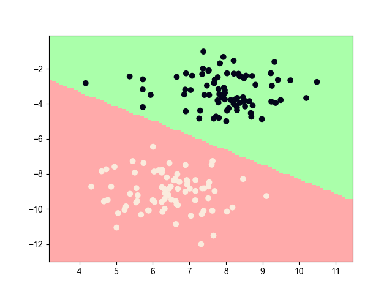

## [分类算法-k近邻](http://www.citisy.site/posts/34112.html)

[KNN.py](Classification/KNN.py)

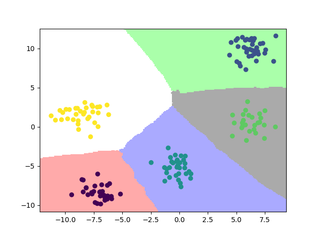</img>

## [分类算法-朴素贝叶斯](http://www.citisy.site/posts/11301.html)

[NaiveBayes.py](Classification/NaiveBayes.py)

|                gaussian_predict2D                 |                gaussian_predict3D                 |
| :-----------------------------------------------: | :-----------------------------------------------: |
| 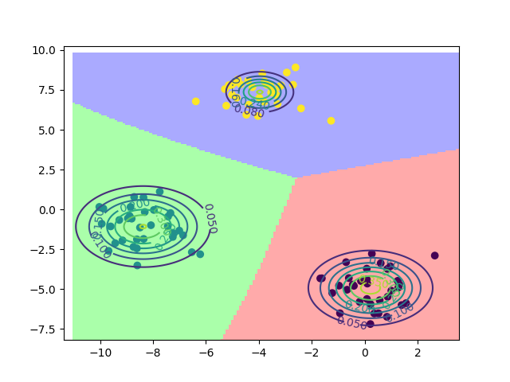 | 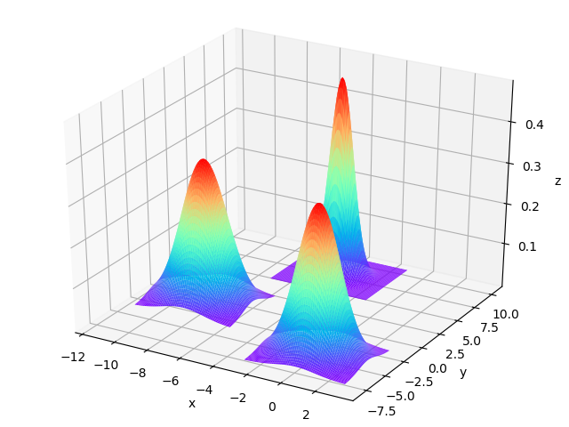 |

## 分类算法-决策树

[DecisionTree.py](Classification/DecisionTree.py)

|          DT_id3           |          DT_c45           |           DT_cart           |
| :-----------------------: | :-----------------------: | :-------------------------: |
|  | 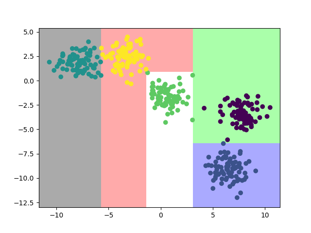 | 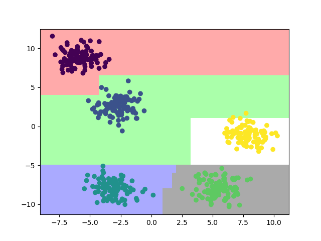 |

## 分类算法-Logistic回归

[LogisticRegression.py](Classification/LogisticRegression.py)

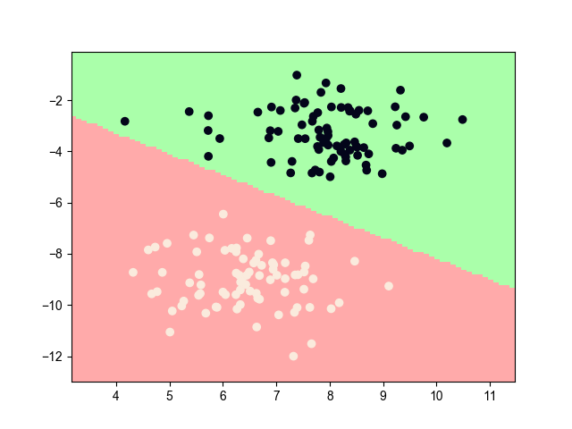</img>

## 分类算法-SVM

[SVM.py](Classification/SVM.py)

|           SVM_svc           |           SVM_1v1           |           SVM_1vr           |
| :-------------------------: | :-------------------------: | :-------------------------: |
|  |  |  |

# Regression

## [回归算法-线性回归](http://www.citisy.site/posts/3280.html)

[LinerRegression.py](Regression/LinearRegression.py)

<video src="img/LinearRegression.mp4" controls="controls" style="max-width: 100%; display: block; margin-left: auto; margin-right: auto;"> your browser does not support the video tag </video>

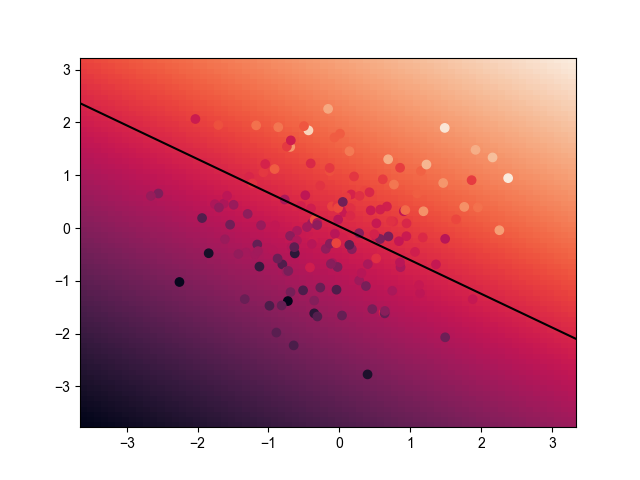

# cluster

## 聚类算法-kmeans

[kmeans.py](cluster/kmeans.py)

</img>

## 聚类算法-DBSCAN

[DBSCAN.py](cluster/DBSCAN.py)

</img>

## 聚类算法-Hierarchical

[Hierarchical.py](cluster/Hierarchical.py)

</img>

## 聚类算法-SOM

[SOM.py](cluster/SOM.py)

| SOM_after_train | SOM_after_train |
| :----: | :----: |
|||

# Dimensionality_reduction

## 降维算法-LDA

[LDA.py](Dimensionality_reduction/LDA.py)

| LDA_before | LDA_after |
| :----: | :----: |
|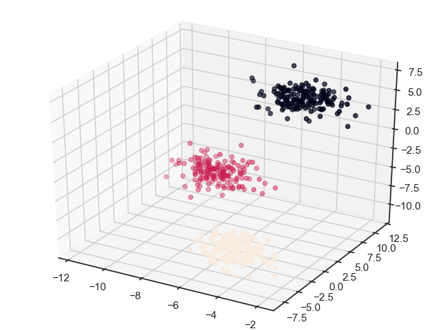|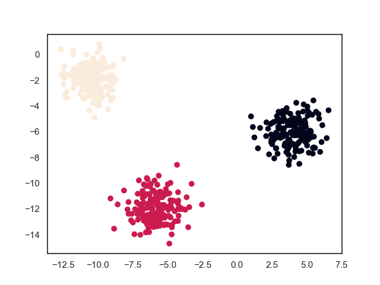|

## 降维算法-PCA

[PCA.py](Dimensionality_reduction/PCA.py)

| PCA_before | PCA_after |
| :----: | :----: |
|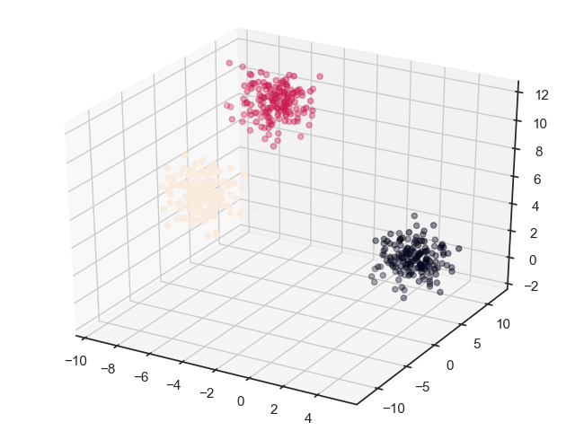|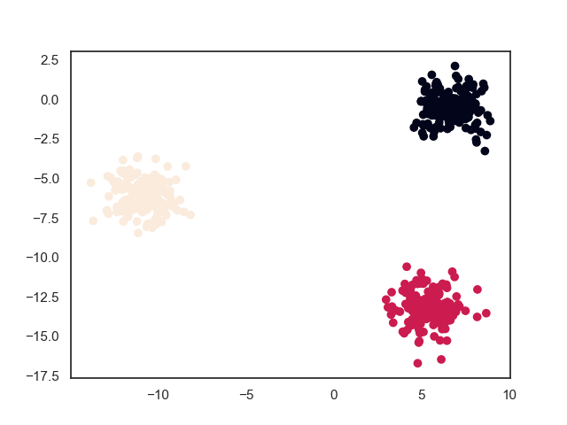|
