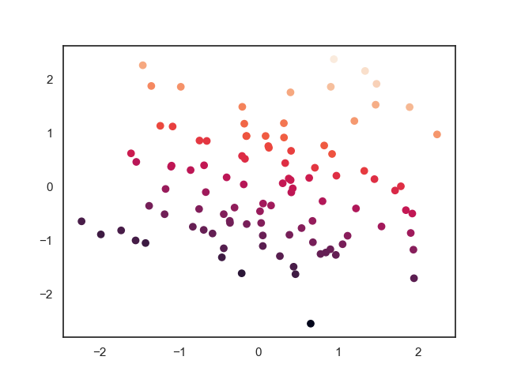

# cluster
### [cluster.py](cluster/cluster.py)

### [kmeans.py](cluster/kmeans.py)

</img>

### [DBSCAN.py](cluster/DBSCAN.py)

</img>

### [Hierarchical.py](cluster/Hierarchical.py)

</img>

### [SOM.py](cluster/SOM.py)

| SOM_after_train | SOM_after_train |
| :----: | :----: |
|||

# Regression
### [LinerRegression.py](Regression/LinerRegression.py)

</img>

# Classification
### [DecisionTree.py](Classification/DecisionTree.py)

### [KNN.py](Classification/KNN.py)

### [LogisticRegression.py](Classification/LogisticRegression.py)

| LogisticRegression_before | LogisticRegression_after |
| :----: | :----: |
|||

### [NaiveBayes.py](Classification/NaiveBayes.py)

| gaussian_predict2D | gaussian_predict3D |
| :----: | :----: |
|||

### [SVM.py](Classification/SVM.py)

| SVM_svc | SVM_1v1 | SVM_1vr |
| :----: | :----: | :----: |
|||

# Dimensionality_reduction
### [LDA.py](Dimensionality_reduction/LDA.py)

### [PCA.py](Dimensionality_reduction/PCA.py)
