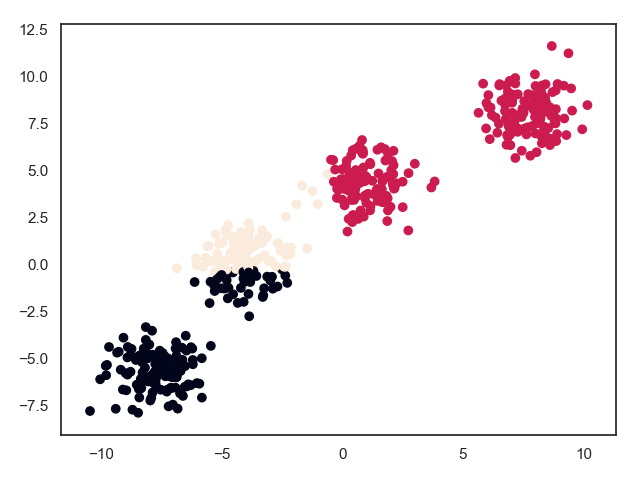
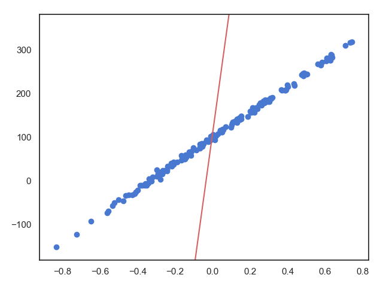
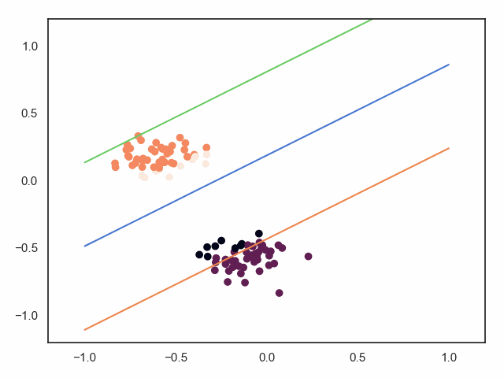
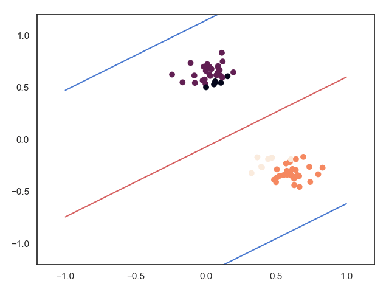
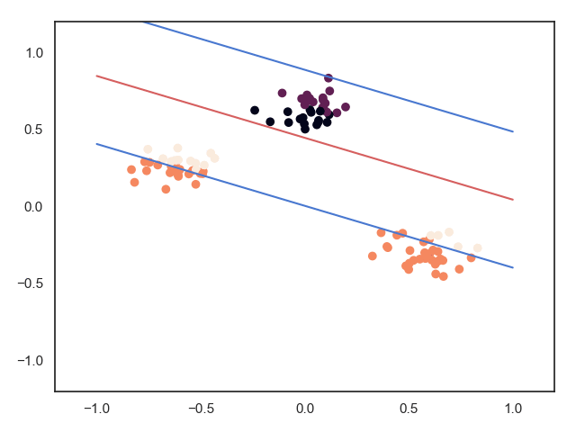

## cluster
***
###### [cluster.py](cluster/cluster.py)
***
###### [kmeans.py](cluster/kmeans.py)
| kmeans |
| :----: |
||
***
###### [DBSCAN.py](cluster/DBSCAN.py)
| DBSCAN |
| :----: |
||
***
###### [Hierarchical.py](cluster/Hierarchical.py)
| Hierarchical |
| :----: |
||
***
###### [SOM.py](cluster/SOM.py)
| SOM_after_train | SOM_after_train |
| :----: | :----: |
|||
## Regression
***
###### [LinerRegression.py](Regression/LinerRegression.py)
| LinerRegression |
| :----: |
||
## Classification
***
###### [DecisionTree.py](Classification/DecisionTree.py)
***
###### [KNN.py](Classification/KNN.py)
***
###### [LogisticRegression.py](Classification/LogisticRegression.py)
***
###### [NaiveBayes.py](Classification/NaiveBayes.py)
***
###### [SVM.py](Classification/SVM.py)
| SVM_svc | SVM_1v1 | SVM_1vr |
| :----: | :----: | :----: |
|||
## Dimensionality_reduction
***
###### [LDA.py](Dimensionality_reduction/LDA.py)
***
###### [PCA.py](Dimensionality_reduction/PCA.py)
