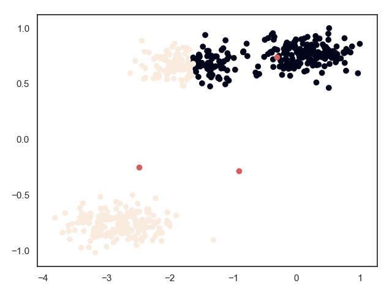
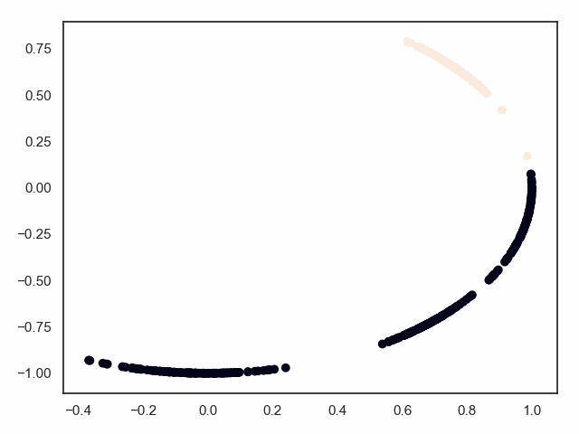

## Classification
######[DecisionTree.py](Classification/DecisionTree.py)
######[KNN.py](Classification/KNN.py)
######[LogisticRegression.py](Classification/LogisticRegression.py)
######[NaiveBayes.py](Classification/NaiveBayes.py)
######[SVM.py](Classification/SVM.py)
## cluster
######[cluster.py](cluster/cluster.py)
######[DBSCAN.py](cluster/DBSCAN.py)

######[Hierarchical.py](cluster/Hierarchical.py)

######[kmeans.py](cluster/kmeans.py)

######[SOM.py](cluster/SOM.py)

## Regression
######[LinerRegression.py](Regression/LinerRegression.py)
## Dimensionality_reduction
######[LDA.py](Dimensionality_reduction/LDA.py)
######[PCA.py](Dimensionality_reduction/PCA.py)
